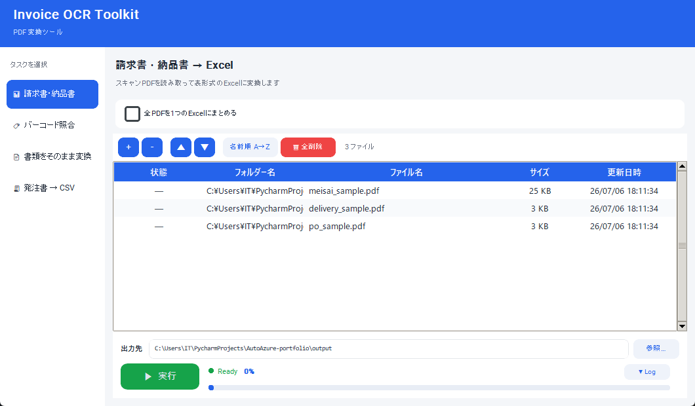
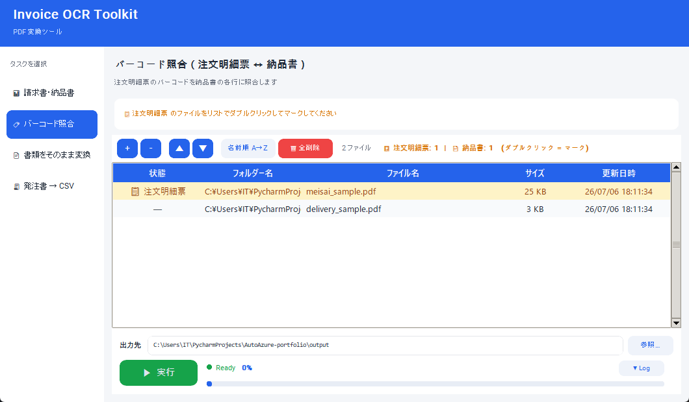
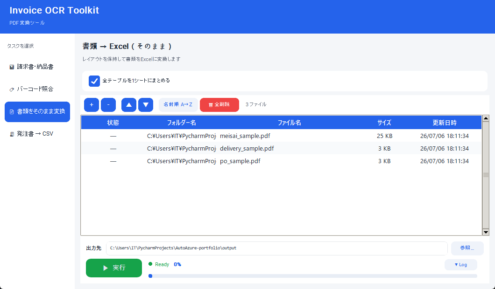
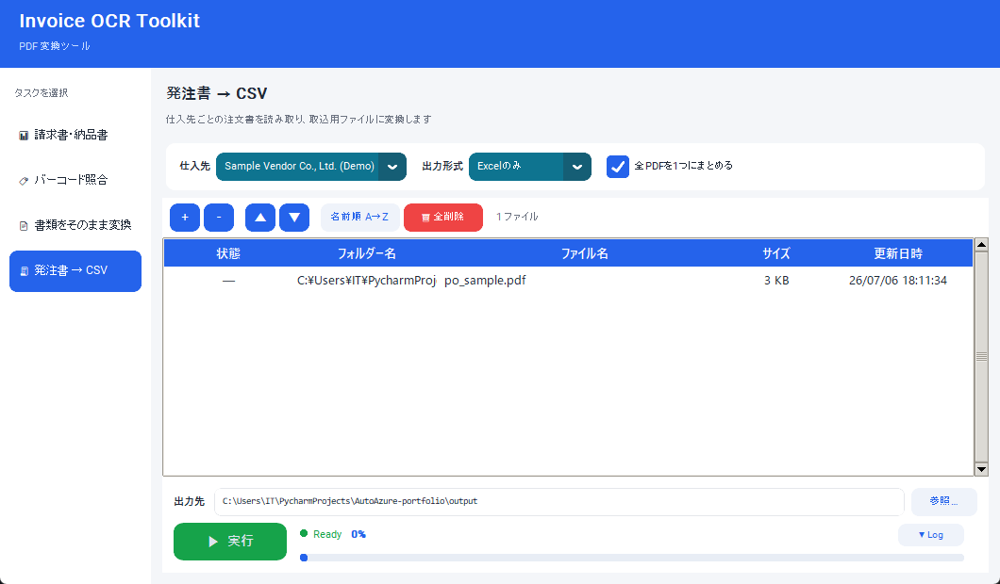

# Invoice OCR Toolkit

**Turn scanned Japanese invoices, delivery notes, and purchase orders into structured Excel/CSV** — Azure AI Document Intelligence for OCR, plus deterministic parsing and geometric barcode matching to handle the messiness of real scanned paperwork.


> This is a sanitized portfolio copy of a tool I built for a real client. All
> company names, vendor configs, and sample documents in this repo are
> synthetic/fictional — see [Sanitization notes](#sanitization-notes) below.

## Screenshots

| | |
|---|---|
|  **Invoice/Delivery note → Excel** |  **Barcode reconciliation** |
|  **Document mode (faithful table export)** |  **Purchase order → CSV/Excel** |

## Features

**1. Invoice/Delivery note → Excel** — Azure `prebuilt-invoice` extraction
with Japanese field labels (発行元, 取引先, 伝票番号, ...), batch conversion
with per-file or combined output.

**2. Barcode reconciliation (注文明細票 ↔ 納品書)** — the most involved piece.
Some documents (order-detail slips) carry a CODE128 barcode per line item;
their paired delivery notes don't. The tool:
- Reads each barcode's page coordinates via Azure's `BARCODES` feature,
  **unioned with a local `pyzbar` pass** (Azure alone misses barcodes on
  dense/faint scans — pyzbar decodes the rendered page image as a fallback
  and the two results get merged/deduped by value + Y-position).
- Pairs a delivery note to whichever order slip shares the most overlapping
  part numbers (documents don't share a common ID and can be scanned out of
  order — pairing is inferred purely from part-number set overlap).
- Matches individual line items to barcodes by part number, using quantity
  grouping to resolve duplicate part numbers unambiguously where possible,
  and flagging genuinely ambiguous groups for manual review instead of
  guessing.
- Outputs a 4-sheet workbook: summary (with a coverage-based confidence
  score per document pair), line-item detail, flagged-for-review items, and
  leftover unused barcodes.

**3. Document mode** — a general-purpose "faithful" PDF→Excel converter: all
tables, all rows/columns, cell merges preserved, no business-rule filtering.
One sheet per table (or combined into one sheet across files).

**4. Purchase order → CSV/Excel** — deterministic, position-based table
parsing per vendor (Azure OCR table structure is far more robust than
regex-on-raw-text, even on scans — no LLM involved). Includes:
- A checksum against the PO's stated total (catches OCR digit errors and
  partially-OCR'd multi-page documents where Azure silently drops pages).
- Configurable customer-name normalization per vendor, so OCR variance
  ("Acme Corp Osaka" vs "Acme Corp, Osaka Branch") maps to one canonical
  name before import into a downstream system.
- Output as `.xlsx` with all columns forced to Text format, to stop Excel
  from mangling numeric-looking part numbers (leading zeros, scientific
  notation, 15-digit truncation).

## Architecture

```
invoice_gui.py      GUI (customtkinter) + invoice/document mode export logic
barcode_match.py    Pure logic: barcode↔line matching, document pairing (unit-testable, no Azure/GUI deps)
po_to_csv.py        Pure logic: PO table parsing, per-vendor config, checksum validation
```

`barcode_match.py` and `po_to_csv.py` have no GUI dependency by design —
matching/parsing logic is testable independently of Azure calls or the UI.

## Setup

```
pip install -r requirements.txt
cp .env.example .env   # fill in your own Azure Document Intelligence endpoint/key
python invoice_gui.py
```

Requires an [Azure AI Document Intelligence](https://azure.microsoft.com/en-us/products/ai-services/ai-document-intelligence)
resource (Free F0 tier caps documents at 2 pages; Standard S0 needed for
longer documents).

## Try it without your own documents

`sample_data/` has three fully synthetic demo PDFs (fictional vendor, fake
part numbers, real scannable barcodes) that exercise all 4 modes, plus
`sample_data/example_output/` with the actual output they produce — so you
can see the tool working without OCR-ing anything real:

| Mode | Input | Output |
|---|---|---|
| Barcode reconciliation | `meisai_sample.pdf` + `delivery_sample.pdf` | `example_output/barcode_match_demo.xlsx` |
| Document mode | any of the sample PDFs | `example_output/document_mode_demo.xlsx` |
| PO → CSV | `po_sample.pdf` | `example_output/po_csv_demo.csv` / `.xlsx` |

The delivery sample intentionally includes one part number that doesn't
exist in the order slip, so the barcode-matching output also demonstrates
the "unmatched" status, not just the happy path.

To regenerate the sample PDFs yourself: `pip install -r requirements-dev.txt`
then `python sample_data/generate_samples.py`.

## Sanitization notes

This repo is a cleaned-up copy of a production tool built for a real
manufacturing client. Removed/replaced before publishing:
- The real Azure credentials (`.env` is gitignored; `.env.example` is a
  template).
- The real vendor/customer configuration in `po_to_csv.py` (`VENDORS`),
  replaced with one fictional sample vendor that demonstrates the same
  structure (column mapping, name-normalization rule, checksum flag).
- All real scanned documents, replaced with synthetic ones generated by
  `sample_data/generate_samples.py`.
- Internal product branding, replaced with a generic app name/title.

The parsing/matching logic itself is unchanged from production.

## License

MIT — see [LICENSE](LICENSE).
